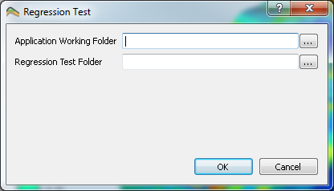

## Command Line Parameters #

Parameter|Description
---------|-----------
`-help, -?`               | Displays help text and version info
`-last`                   | Open last used project
`-project <filename>`     | Open project file <filename>
`-case <casename>`        | Import Eclipse case <casename> (do not include .GRID/.EGRID)
`-savesnapshots`          | Save snapshot of all views to 'snapshots' folder in project file folder. Application closes after snapshots are written to file.
`-regressiontest <folder>` | Run a regression test on all sub-folders starting with `TestCase*` of the given folder. **RegressionTest.rip** files in the sub-folders will be opened and snapshots of all the views is written to the sub-sub-folder **RegTestGeneratedImages**. Then difference images is generated in the sub-sub-folder **RegTestDiffImages** based on the images in sub-sub-folder **RegTestBaseImages**. The results are presented in **ResInsightRegressionTestReport.html** that is written in the given folder.
`-updateregressiontestbase <folder>` | For all sub-folders starting with `TestCase*`, copy the images in the sub-sub-folder **RegTestGeneratedImages** to the sub-sub-folder **RegTestBaseImages** after deleting **RegTestBaseImages** completely.

## Regression test system

A regression tool for QA is build into ResInsight. This tool will do the following: 

1. Scan a directory for sub directories containing a RegressionTest.rip files. 
2. Each found project file will be opened, and all views in this project will be exported as snapshot images to file.
3. When snapshot images from all projects are completed, difference images based on generated and QA-approved images are computed. 
4. Based on these three sets of images, an HTML report is created and automatically displayed.

### Starting regression tests

To be able to run regression tests you need the *compare* tool from the ImageMagic suite.

You can start the tests either from the command line or from the ResInsight Gui.
From the ResInsight Gui select : **Debug -> Regression Test Dialog**



The **Application Working Folder** is basically the path to the executable of the image compare utility used, even though the CWD of Resinsight is temporarily changed to this path during execution.

### Creating regression tests

An example of the folder structure is shown below:

```
RegressionTestFolder/
  TestCase1/
    RegressionTest.rip
    RegTestBaseImages/
    RegTestDiffImages/
    RegTestGeneratedImages/
  TestCase2/
    ...
```

To create regression tests you need to do the following:

1. Create a root directory containing one directory for each testcase. 
2. In each of the Test Case folders create a Resinsight project file called RegressionTest.rip.
3. Run the regression test for the first time, and thereby creating images that can be used as Base images.
4. Rename the generated RegTestGeneratedImages/ folder to RegTestBaseImages/

Now you are all set to test new releases of ResInsight towards your own Regression tests.

