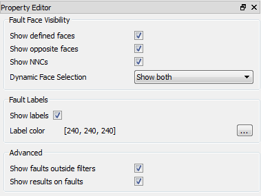

[ Contents ](UsersGuide.md#contents)

-----
## Faults

ResInsight can import faults from `*.DATA` files, and is available in the  **Faults** item in the **Project Tree**. The imported faults are ordered in ascending order based on name.

As import of faults can be time consuming, reading of faults can be disabled from **Preferences -> Read fault data**

A fault is defined as a set of cell faces. When clicking on a fault, the fault name is displayed in **Result Info**. Results can be mapped onto a fault, and **Dynamic Face Selection** controls the cell result mapping onto faults. Faults are given a color on import, and this color can be controlled by activating the fault and select **Fault color**.

When clicking on a NNC,  the relevant data for this NNC is displayed in the **Result Info**. The static result **CombindedTRANS** can be mapped onto NNC geometry.  

ResInsight will detect all cell faces with no matching neighbor. All detected cell faces are compared to faults imported from disk, and if no fault face is defined for a cell face, the cell face is added to a fault called **Unnamed grid faults**.

### Toolbar control
Visualization mode and mesh lines can be controlled from the toolbar.

-  Toggle button to control faults only visualization mode
-  Shows surface visualization
-  Shows mesh lines on faults
  

### Common Fault Options
By clicking the  **Faults** item in the **Project Tree**, the following options are displayed: 

 
 

- **Show defined faces**: Displays the defined fault cell faces
- **Show opposite faces**: Displays the opposite fault cell faces based on IJK neighbor data
- **Show NNCs**: Displays non neighborhood connections (see details below)
- **Dynamic Face Selection**: Controls mapping of cell results onto a fault, either from cell in front of fault, from cell behind fault or both.

- **Show labels**: Displays one label per fault with fault name
- **Label color**: Defines the label color
 
- **Show faults outside filters**: Default behavior is to hide faults outside filters. Turning this option on, will display faults outside filter region. 
- **Show results on faults**: Map currently selected result onto fault. **Dynamic Face Selection** controls which cell results to map onto faults.

------
[ Contents ](UsersGuide.md#contents)

 
