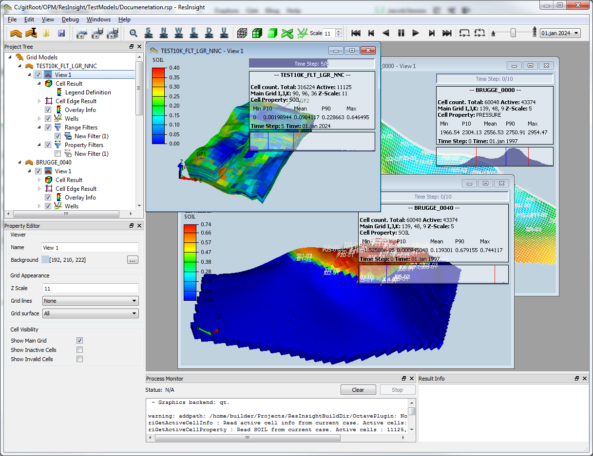
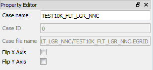
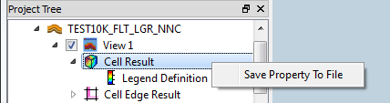

[ Contents ](UsersGuide.md#contents)

-----
## Getting started with ResInsight 

### Installation
Installation instructions for ResInsight can be found here: [Installation and Configuration](Installation.md) 

### User interface overview 

The application has a main area and several docking windows. The different docking 
windows can be managed from the **Windows** menu or directly using the local menu bar of the docking window.

#### Docking Windows

- **Project Tree** - contains all application objects in a tree structure.
- **Property Editor** - displays all properties for the selected object in the **Project Tree**
- **Process Monitor** - displays output from Octave when executing Octave scripts
- **Result Info** - displays info for the object being hit in the 3D scene when clicking with left mouse button

*TIP:* A new project tree and property editor can be added from **Windows->New Project and Property View**.

### Toolbars 

A selected subset of actions are presented as controls in the toolbar. The different sections in the toolbar can be dragged and positioned anywhere as small floating toolbars. Management of the toolbar is done by right-clicking on the toolbar and then manipulating the displayed menu.

#### 3D Views 

In the main area of the application, several 3D views can be open at the same time.  One of them will be active and the active view can be either maximized to use the whole main area, or normalized so that you can see all the open 3D views.

*TIP:* To see views next to each other select the **Restore down** icon in the application show here for Windows :

#### Editing the views

Most of the settings and features of ResInsight is accessible through the **Project Tree** and the **Property Editor**. Selecting an item in the **Project Tree** activates the corresponding 3D View, and shows the item properties in the **Property Editor** available for editing. 

Toggling a checkbox next to an item in the **Project Tree** will toggle visibility in the 3D view. Toggling a checkbox for a collection of items will affect the visibility for all items in the collection. 

Context menu commands are also available to do special operations on a selected set of items.

### Cases and their types

A *Case* in ResInsight means a Grid model with a particular set of results or property data. There are  
three different Case types: 

##### Result case  
This is a Case based on the results of an Eclipse analysis, read from a grid file together with restart data.

##### Input case  
This Case type is based on a `*.GRDECL` file, or a part of an Eclipse *Input* file. This Case type supports loading single ASCII files defining Eclipse Cell Properties, and also to export modified property sets to ASCII files.
Each of the Eclipse properties is listed as separate entities in the **Project Tree**, and can be renamed and exported.

#####  Statistics case 
This is a Case type that belongs to a *Grid Case Group* and makes statistical calculations based on the source cases in the Grid Case Group. 

#### Grid Case Groups  

A **Grid Case Group** is a group of **Result Cases** with identical grids, but generally different active cells, initial values and results. These cases are called *Source Cases*. 

The purpose of a Grid Case group is to make it easy to calculate statistics across the source cases both for static and dynamic Eclipse Properties. 

See [ Multiple realizations and statistics ](CaseGroupsAndStatistics.md) for more on this.

### Importing data

#### Input data support ###

ResInsight supports the following type of Eclipse input data:
- `*.GRID` and `*.EGRID` files along with their `*.INIT` and restart files `*.XNNN` and `*.UNRST`. 
- Grid and Property data from  `*.GRDECL` files.

#### Importing Eclipse cases 

##### Eclipse Results
1. Select **File->Import->Import Eclipse Case** and select an `*.EGRID` or `*.GRID` Eclipse file for import.
2. The case is imported, and a view of the case is created

*TIP:* You can select several grid files in one go by multiple selection of files( Ctrl + left mouse button, Shift + left mouse button). 

##### Eclipse ASCII input data
1. Select **File->Import->Import Input Eclipse Case** and select a `*.GRDECL` file.
2. The case is imported, and a view of the case is created
3. Right click the **Input Properties** in the generated **Input Case** and use the context menu to import additional Eclipse Property data files.

##### Handling missing or wrong MAPAXES

The X and Y grid data can be negated in order to make the Grid model appear correctly in ResInsight. This functionality is accessible in the **Property Editor** for all Case types as the toggle buttons **Flip X Axis** and **Flip Y Axis** as shown in the example below.
 

### Model navigation 

ResInsight comes with two 3D navigation modes. The active mode can be selected in the **Preferences** dialog (**Edit -> Preferences**).

|Abbreviation | Meaning |
|-------------|---------|
|LMB          | Pressing left mouse button |
|MMB          | Pressing Middle mouse button or scroll wheel button |
|RMB          | Pressing Right mouse button |

#### Ceetron navigation mode

|Mouse interaction | Action |
|------------------|---------|
|LMB               | Pan model |
|MMB               | Zoom to mouse pointer location |
|Scroll wheel      | Zoom to mouse pointer location |
|RMB               | Rotate model |
|                  | |                    
|RMB single click  | Context menu |
|LMB single click  | Update status bar and **Result Info** |

#### CAD navigation mode

|Mouse interaction | Action |
|------------------|--------|
|MMB               | Rotate model |
|MMB + Shift       | Pan model |
|Scroll wheel      | Zoom to mouse pointer location |
|                  | |
|RMB single click  | Context menu |
|LMB single click  | Update status bar and **Result Info** |

### Project files and Cache directory

ResInsight stores which cases you have imported and all the settings for each view etc. in a project file with the extension `.rsp`.
This file only contains references to the real data files, and even references to data files generated by ResInsight itself.

Statistics calculations, property sets you generate by using Octave, and well paths are saved to a folder in the same directory as you save the project file, and is named \<ProjectFileName\>_cache. So if you need to move your project, make sure you move this folder as well.

*TIP:* The `.rsp`-file is an XML file, and can be edited by any text editor.  

### Export options
#### Snapshot images 
##### Single View  
Image export of current 3D view can be launched from **File -> Export -> Snapshot To File**. A snapshot can also be copied to clipboard using **Edit->Copy Snapshot To Clipboard**. 

##### All Views 
If a project contains multiple views, all views can be exported using **File -> Export -> Snapshot All Views To File**. 

It is also possible to snapshot all views from the command line. See  [ Command Line Arguments]      (CommandLineParameters.md)

#### Export of Eclipse Properties as ASCII data
Eclipse Properties can be exported to Eclipse ASCII files by activating the context menu for a **Cell Result**.  

The command will export the property set currently loaded and shown in the 3D View to a file with the following format:

    -- Exported from ResInsight
    <keyword>
    <One number per cell separated by spaces>
    /

------
[ Contents ](UsersGuide.md#contents)
