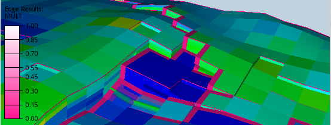
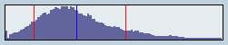
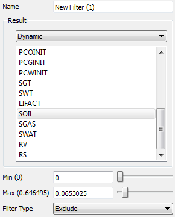

## Working with 3D Views

3D Views are the windows displaying the Grid Models. The visualization is controlled by the **Project Tree** item representing the **View** and their subitems. Each item has a set of proerties that can be editied in the **Property View**.

Below is a description of the most important View settings and their properties.

### Cell Result 

The **Cell Result** item defines which Eclipse property the 3D View uses for the main cell color. The property can be chosen in the property panel of the **Cell Result** item. The mapping between cell values and color is defined by the **Legend Definition**   along with some appearance settings on the Legend itself. (Number format etc.)

### Cell Edge Results 

The **Cell Edge Result** visualization mode is one of ResInsights special features. Its main use is to show the MULT(X, Y, Z) properties at the same time. 
This will show the MULT property values *different from 1.0* along the correct edges og the cells. In effect this highlights the Faults, and makes it easy to verify all the MULT values in one go.

ResInsight supports all Properties ending with X, Y, Z or (X-, Y-, Z-) but without the filtering done for the MULT propery.

When selecting a result variable for cell edge, a second legend shows up in the 3D view. Color legend management is available when selecting the **Legend Definition** item belonging to the **Cell Edge Result** item. 

### Overlay Info

The **Overly Info** controls the visibility of the animation progress, the info box, and the results histogram.

The **Results Histogram** shows a histogram of the currently loaded **Cell Result** together with:

- The mean value ( a blue line ) 
- P10 and P90 ( red lines )

### Cell Filters
Cell Filters are used to control visibility of the cells in the 3D view. Three types of filters exists:

- **Range filter** : 		Define a IJK subset of the model.
- **Property filter** : 	Define a value range for a property to control cell visibility.
- **Well cell filter** : 	Display grid cells that has connections to a well.

All filters can be turned on or off using the toggle in the **Project Tree** and controlled from their corresponding **Property Editor**.

#### Range filters

Using range filters enables the user to define a set of IJK visible regions in the 3D view.
A new range filter can be added by activating the context menu for the **Range Filters** collection in the **Project Tree**.

*TIP:* An I,J or K-slice range filter can be added directly from a Cell in the **3D View** by rightclicking the cell and using the context menu. 

Below is a snapshot of the **Property Editor** of the **Range Filter** :

 - **Filter Type** The filter can either make the specified range visible ( *Include* ), or remove the range from the View ( *Exclude* ).
 - **Grid** This option selects which of the grids the range is addressing.
 - **Apply to Subgrids** This option tells ResInsight to use the visibility of the cells in the current grid to control the visibility of the cells in sub-LGR's. If this option is turned off, Sub LGR-cells is not included in this particular Range Filter.  
 
The **Start** and **Width** labels in front of the sliders features a number in parenthesis. 
The **Start** labels shows the index of the start of the active cells. 
The **Width** labels shows the number of active cells from the start of the active cells.

#### Property filters

**Property filters** apply to the results of the **Range filters**. Below is a snapshot of the **Property Editor** of the **Property Filter**.
  

This filter filters the cells based on a property value range (Min - Max). Cells whithin the range is either shown or hidden depending the **Filter Type**.( *Include* / *Exclude* ). Exclude-filters removes the selected cells from the View even if some other filter includes them.

A new property filter can be made by activating the context menu for **Property Filters**. The new property filter is based on the currently viewed cell result, by default.

### Wells

#### Well range filter 
Select **Wells** in the **Project Tree**. In the **Property Editor**, select **On** for **Add cells to range filter**. This will hide cells not part of a well.
In addition, all cells along a direction can be added as a fence. Enable this by checking **Use well fence**.
