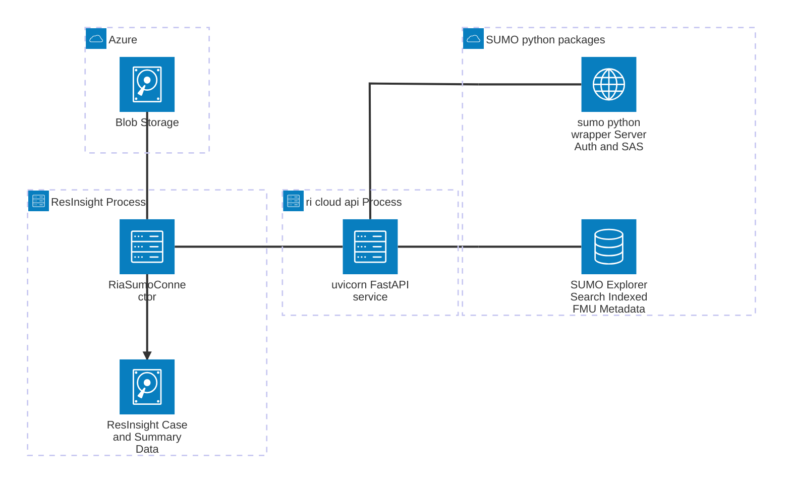
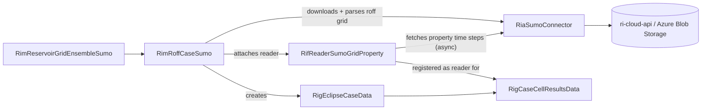
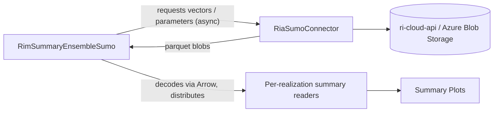

# Cloud Data Architecture

How ResInsight retrieves ensemble grid and summary data from SUMO. Three tiers are involved:
SUMO itself (Equinor's cloud store for FMU results), the local `ri-cloud-api` service that
ResInsight launches as its own **`ri-cloud-api` process** (a separate OS process from ResInsight
itself, running a uvicorn FastAPI service), and the C++ code in ResInsight that talks to it and
turns the results into grid cases and summary ensembles.

See also [cloud-service-api.md](cloud-service-api.md) for how the Python service is installed and
launched.

## Overview

## Components

### SUMO (Equinor cloud store)

- Stores FMU (Fast Model Update) ensemble results: case/ensemble/realization metadata, grid
  geometry and grid property blobs (roff), summary vectors and ensemble parameters (parquet).
- **Sumo core** is the backend proper: it owns the ElasticSearch index (case/ensemble/realization/
  object metadata and search) and exposes the API in front of it — including authentication and
  issuing the short-lived SAS (Shared Access Signature) tokens used to download blobs. It is
  written in Node.js and is self-hosted on Azure; ElasticSearch is not a separate system reached
  independently, it lives behind this one API.
- **`sumo-wrapper-python`** is a thin Python wrapper around that API: it makes the Sumo API easier
  to call from Python and provides the basic plumbing — authentication and retry handling — without
  adding any FMU domain knowledge of its own.
- **`fmu-sumo`'s `Explorer`** is built on top of `sumo-wrapper-python`. It is an FMU-aware Python
  library for reading FMU results out of Sumo, offering an intuitive, domain-level interface
  (assets, cases, ensembles, realizations, grid/summary objects) instead of raw API/ElasticSearch
  calls, and is what `ri-cloud-api` actually calls to look things up.
- The blob bytes themselves are **not** served by the Sumo core API in the current solution — a
  lookup returns a SAS token and a blob-store base URI, and `RiaSumoConnector` downloads the blob
  directly from **Azure Blob Storage**. `fmu-sumo`'s `Explorer` objects *can* also hand back blob
  bytes/dataframes directly (e.g. `.blob`, `.values` on a search result), which would let
  `ri-cloud-api` serve the bytes itself instead of a SAS token — that path is not used today, but
  is a possible future option if there is a reason to route the data through the service rather
  than fetching it directly from Azure.
- Authentication to SUMO is Azure AD (Entra ID) OAuth2 Authorization Code Flow, handled in
  ResInsight by `RiaCloudConnector`/`RiaSumoConnector` (opens a browser once for sign-in, then
  reuses the token).

### `ri-cloud-api` (local Python service, submodule `scripts/ri-cloud-api`)

- A FastAPI app (`ri_cloud_api.main:app`) that ResInsight starts on demand as a local subprocess
  (`RiaCloudApiService`, via `uvicorn` on `127.0.0.1:<free port>`) once the user signs in.
- Bridges ResInsight's simple REST calls to the SUMO client libraries:
  - `fmu-sumo` — the Explorer, an FMU-aware library for reading FMU results/metadata from Sumo
    (case/ensemble/realization/object search), built on top of `sumo-wrapper-python`.
  - `sumo-wrapper-python` — the thin Python wrapper for the Sumo API that `fmu-sumo` (and
    `ri-cloud-api`, where needed directly) uses underneath: authentication, retries, and
    SAS-token/blob-access-info retrieval.
  - `ri-cloud-core-utils` and `ri-cloud-services` — the two workspace libraries under
    `libs/core_utils` and `libs/services` that implement the service logic on top of those.
- Routers exposed (`ri_cloud_api/primary/routers`): `explore` (assets/cases/ensembles/
  realizations), `grids` (grid + grid property blob ids), `timeseries` (summary vector blob ids,
  aggregated on demand), `parameters` (ensemble parameters), `surfaces`, `polygons`,
  `blob_access` (SAS token + blob-store base URI lookup), `health` (`/alive`).
- Runs entirely on `127.0.0.1`; nothing outside the local machine can reach it.

### ResInsight (C++ client side)

- `RiaCloudApiService` — starts/stops the local `uvicorn` process, finds a free port, and polls
  `/alive` until the service is ready.
- `RiaSumoConnector` — owns the HTTP transport (OAuth2 token, a dedicated transfer thread,
  blocking and async request helpers) and three data-specific delegates:
  - `RiaSumoExplore` — assets, cases, ensembles, realizations.
  - `RiaSumoGrid` — grid names/dimensions, grid geometry (roff), grid property blobs, sync and
    async batched property time steps.
  - `RiaSumoSummary` — summary vector names/values, ensemble parameters, sync and async.
- Blob retrieval is always two round trips, done through the connector:
  1. `GET .../blobs/{id}/sas_token_and_blob_base_uri` on the local `ri-cloud-api` service →
     `{ sasToken, blobStoreBaseUri }`.
  2. `GET {blobStoreBaseUri}/{id}?{sasToken}` **directly against Azure Blob Storage** → the blob
     bytes (roff grid/property data, or parquet summary/parameter data).
- Consumers:
  - `RimRoffCaseSumo` + `RifReaderSumoGridProperty` — one Sumo grid realization becomes a
    `RimEclipseCase`. The grid geometry is downloaded and parsed up front; grid properties are
    fetched lazily/asynchronously the first time a time step is displayed, decoded straight into
    `RigCaseCellResultsData` (no long-lived copy of the downloaded bytes is kept).
  - `RimSummaryEnsembleSumo` — a Sumo ensemble becomes a `RimSummaryEnsemble`. Vector data and
    ensemble parameters are fetched asynchronously (parquet, one blob per vector/parameter set)
    and decoded into the summary case's readers.

## `RimRoffCaseSumo` (grid case)

## `RimSummaryEnsembleSumo` (summary ensemble)

