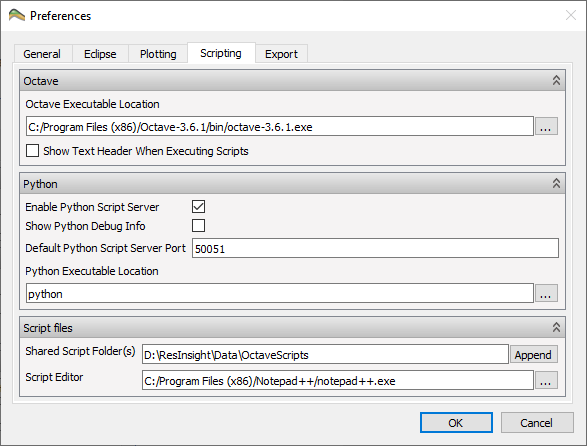

Installation and Configuration
==============================

.. image:: images/python-logo-master-v3-TM.png

The ResInsight Python API is compatible with `Python 3 <https://www.python.org/download/releases/3.0/>`_. 
As admin user, the necessary Python client package is available for install via the Python PIP package system:

.. code-block:: console

   pip install rips

or as a regular user:
   
.. code-block:: console

   pip install --user rips
   
On some systems the `pip` command may have to be replaced by `python -m pip`.

The ResInsight Python API is based on `gRPC <https://www.grpc.io/>`_ remote procedure calls. 
In order for gRPC to be available, ResInsight needs to be built with the **RESINSIGHT_ENABLE_GRPC** option set. 
A valid gRPC build will show a message in ResInsight *About* dialog confirming gRPC is available.

.. image:: images/AboutGrpc.png

Furthermore, gRPC needs to be enabled in the *Scripting* tab of the ResInsight *Preference* dialog:

